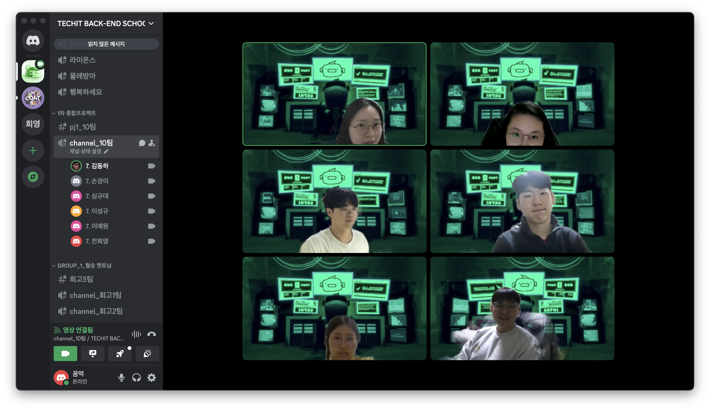

## 팀 구성원, 개인 별 역할

---
- 이성규(팀장, 회의 주도, 요구사항 명세서 작성, DB 설계, 게시판 개발)
- 김동하(프레젠테이션, 발표자료 작성, 요구사항 명세서 작성, DB 설계, 예약/결제 레퍼런스)
- 손경이(서기, 회의록 작성, 요구사항 명세서 작성, DB 설계, 에약/결제 레퍼런스)
- 심규대(요구사항 명세서 작성, DB 설계, 회원관리 레퍼런스)
- 이예원(ERD 다이어그램 작성, 요구사항 명세서 작성, DB 설계, 회원관리 레퍼런스)
- 전희영(프로젝트 문서 관리, 요구사항 명세서 작성, DB 설계, 예약/결제 레퍼런스)

## 팀 내부 회의 진행 회차 및 일자

---
1. 1회차(2024.01.29) 배포 관련 회의(17~18시, 전원참석)
    - 일일 할일 공유
    - 배포 관련 공지
2. 2회차(2024.01.30) 최초 PullRequest 진행(종일, 전원참석)
   - 최초 PR 후 GIT협업 및 에러 수정
   - 카카오 디벨로퍼에서 앱비즈앱 전환 신청
3. 3회차(2024.01.31) PullRequest 진행(종일, 전원참석)
   - PR 후 발생하는 에러 해결
   - DB 확인 방법 공지
   - 게시글 및 장소부분 기능 개발 분배
4. 4회차(2024.02.01) 강사님 2차 코칭 및 회의(13~14시, 전원참석)
   - 강사님 2차코칭 (현재 작업 경과 확인, 앞으로 할일 정리)
   - 소셜로그인 안되는 문제 해결
   - 테스트용 admin 계정 공지
5. 5회차(2024.02.01) 3주차 위클리 공유 작성(17~18시, 이성규, 김동하 병원)
   - 일일보고서 작성 리마인드
   - 3주차 위클리 공유 작성

## 현재까지 개발 과정 요약 (최소 500자 이상)

---
- 목표 : 예약 기능 구현
- 목표 달성률 : 50%
- 성과 자체 평가  
  전희영님
  - 새로 알게 된 점 : 테스트시 MockMvc를 사용할 때, restAPI와 서버사이드 렌더링의 두가지 경우에서 보안(JWT토큰, CSRF토큰 등 사용)에 따라서 다르게 테스트를 진행해야한다는 것을 알게됨.
  - 어려운 점 : 코드의 내용이 일부 변경될 때마다, 테스트를 신경써야하는 부분이 어렵다. 분명 코드가 제대로 작동하는지 간단하게 확인 할 수 있지만 실제 환경과 테스트의 차이로 인해 놓치는 부분이 생기기도 한다.  
  그 예로 테스트에서는 POST, PUT, DELETE 맵핑에 csrf 토큰을 전부 넣었으나, 실제 코드에서는 CSRF토큰을 놓쳐 403 Fobidden이 뜨기도 했다.
  그리고 JPA를 사용 시 테이블의 타입의 변경이 생기면 자동으로 반영해주나(ddl-auto : update 설정) 타입 변경, 상속관계 변경 등은 제대로 대응하지 못하여 해결이 어렵다. 
  - 아쉬운 점 : 처음 구현하는 기능에 대해서는 다소 어려움이 있어서 진척이 잘 되지 않는다.

- 목표 : 카카오맵 과 게시글 데이터 연결
- 목표 달성률 : 30%
- 성과 자체 평가  
  김동하님 
  - 새로 알게 된 점 : api 문서 내 검색 스크립트 이해하기
  서블릿 ,jsp 게시판 글쓰기 구현 하기 문서 분석해서 코드 테스트해보았다.
  - 아쉬운 점 : 로직에대한 공부와, 게시글 데이터insert form 을 완벽히 만들지 못해 아쉽다.

- 목표 : 배포  
- 목표 달성률 : 100% 
- 성과 자체 평가   
    손경이님
  - 새로 알게된 점 : 깃허브 시크릿 환경변수를 저장할 때 주석으로 인해서 배포할 때 application-secret.yml 가 만들어지지 않았습니다. 시크릿 환경변수에는 주석 빼고 저장해야하는 점을 배웠습니다.
  - 아쉬운 점 : 배포를 끝내고 세심하게 application-secret.yml이 잘 들어오는 지 신경을 못 썼습니다.

- 목표 : 사용자 예약 정보 저장, 결제
- 목표 달성률 : 50%
- 성과 자체 평가  
  손경이님
  - 아쉬운 점 : 기획 단계에서 예약-결제 기획을 제대로 못했던 거 같습니다. 막상 코딩을 시작하려고 하니 어떻게 사이트가 운영되는지 머리속으로 그려지지 않아서 바로 시작을 못 하고 팀원들과 다시 한 번 더 기획을 생각하고 코딩을 시작해서 코딩 시작을 늦게했습니다. 
  - 시도해볼 점 : 생각했던 기획을 정리하기

- 목표 : 소셜 로그인  
- 목표 달성률 : 100%  
- 성과 자체 평가  
    심규대님  
  - 새로 알게된 점 :  secret.yml 에 주석이 있다면 제대로 동작하지 않는다. git pull rebase 진행 시 과거 커밋 부터 리베이스가 진행되므로 최대한 자주 git pull을 해주는 것이 좋다

- 목표 : 로그인한 유저의 프로필 이미지 출력  
- 목표 달성률 : 70%  
- 성과 자체 평가  
    심규대님  
  - 새로 알게된 점 : mac도 자동으로 c/ 경로가 생긴다. 
  - 아쉬운 점 : 로그인 유저의 이름은 정상적으로 불러와지나 이미지가 제대로 불러와지지 않는다. 
  - 시도해볼 점 : mac 으로 개발을 진행 중이라 경로 설정에 문제가 있어 작동하지 않는 것 같아서 해결해봐야 한다.

- 목표 : 회원 관련 코드 수정 및 정리, 코드 취합 중 발생한 충돌 해결  
- 목표 달성률 : 100%  
- 성과 자체평가  
    이예원님  
    - 중간에 git pull origin main --rebase를 빠뜨리고 push했던 커밋이 있어서 해결하는데 조금 시간이 걸렸다. 작업 도중 로컬에 백업해둔 코드를 이용해 비교적 간단하게 복구할 수 있어 다행이었지만, 시간을 소요하는 일이므로 한 번 push&merge를 한 뒤로는 빠뜨리지 않고 pull을 하도록 주의하고 있다.

- 목표 : 마이페이지 화면 구성
- 목표 달성률 : 20%
- 성과 자체평가 :  
    이예원님  
    - 마이페이지에 들어가야 할 요소들을 tab으로 구성하려 하는데, 아직 ui 프레임워크를 도입하지 않아 어떤 방식으로 만들어야 할지 많이 고민했던 것 같다. 우선 html과 css, js, jquery를 이용해 간단한 탭만 작성하였는데, 처음에 jquery를 도입해야 탭이 작동한다는 것을 모르고 html, css, js으로만 작성해서 해결하는데 시간을 잡아먹었던 것 같다. 주말을 이용해서 현재 비어있는 마이페이지 화면을 진척시켜야겠다는 생각이 들었다.

## 개발 과정에서 나왔던 질문 (최소 200자 이상)

---
프로젝트 폴더 구조 어떻게 하는 게 좋을까요?
PR 올리기 전에 git pull origin main --rebase 하니 브랜치 명 뒤에 rebase4/4 뜨는데 문제 없는걸까요?
Squash로 안하고 Merge Commit을 했습니다. 괜찮을까요?
원래 배포시에 테스트 폴더까지 빌드 하는건가요?
application.yml과 application-secret.yml 원격 리포지터리에 반영하면 어떨까요?
Member 관련된 findByUsername 메서드 해당 기능이 필요한데 Member 기능을 맡으신 분이 하면 좋을 거 같습니다. findByUsername 메서드 만들어주실 수 있나요?
혹시 서버에 올라가 있는 유저 중에 테스트 해볼 아이디랑 비밀번호 알려주실 수 있나요?
application.yml 에 tempDirPath 부분, 중복되는 코드가 있습니다. 하나로 합칠까요?

## 개발 결과물 공유

---

[Github Repository URL](https://github.com/Tour-de-Monde/Tour-de-Monde)

